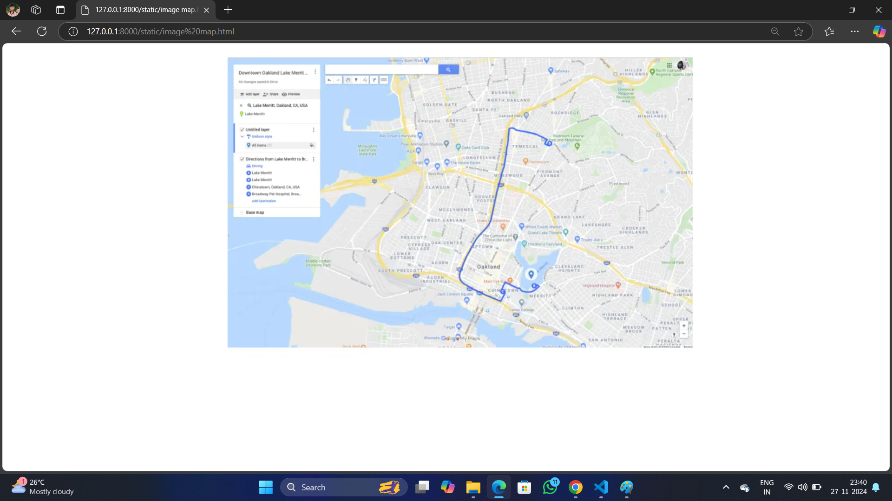

# Ex04 Places Around Me
# Date:27.11.2024
# AIM
To develop a website to display details about the places around my house.

# DESIGN STEPS
## STEP 1
Create a Django admin interface.

## STEP 2
Download your city map from Google.

## STEP 3
Using <map> tag name the map.

## STEP 4
Create clickable regions in the image using <area> tag.

## STEP 5
Write HTML programs for all the regions identified.

## STEP 6
Execute the programs and publish them.

# CODE
```
<html>
    <center>
    
    <map name="google map">
        <area shape="rect"  alt=" google map" coords="149,157,372,46" href="image map 1.html" >
        <area shape="poly" alt="google map" coords="42,338,186,295,314,430,181,458" href="image map 3.html">
        <area shape="circle" alt="google map" coords="590,331,112" href="Cimage map 2.html">
        <area shape="poly" alt="google map" coords="412,57,701,43,689,215" href="image map 4.html">
        <area shape=" rect" alt="google map" coords="313,196,488,331" href="image map 5.html">
    </center>
</html>

<html>
    <head>
        <center>
         <h1  style="color: white;" > Saveetha Engineering College</h1>
        </center>
    </head>
     <body bgcolor="darkblue">
        <center>
        
        <hr>
        <h1 style="color: white;">Saveetha Engineering College is a co-educational Institution. The College is affiliated with Anna University, Chennai, the largest technical university in India. Saveetha Engineering College is granted Autonomous status by University Grants Commission (UGC)., Affiliated to Anna University located in Chennai, India.</h1>
        <br>
        <br>
        <hr>
        <br>
        <br>
        <h2 style="color: white;">Engineering College is a co-educational Institution. The College is affiliated with Anna University, Chennai, the largest technical university in India.[1] Saveetha Engineering College is granted Autonomous status by University Grants Commission (UGC)., Affiliated to Anna University located in Chennai, India. It was founded in 2001 by the Saveetha Medical and Educational Trust, a registered charitable society. Approved by the All India Council for Technical Education (AICTE), a statutory body of the Government of India, and also by the Government of Tamil Nadu. The campus is facing Chembarambakkam lake on the Chennai-Bangalore National Highway (NH4), Thandalam, Kancheepuram District, Chennai, Pin: 602105. Located about 8 km (5.0 mi) from Poonamalee township.</h2> 
        </center>
     </body>
    </html>

 <html>
    <head>
        <center>
        <h1>PANIMALAR ENGINEERING COLLEGE </h1>
        <hr>
        
        <br>
        <hr>
        </center>
    </head>
    <body bgcolor="cyan ">
        <center>
            <h1>The college is located near Poonamallee, Chennai, and is well connected by road covering, Chennai, Kancheepuram and Thiruvallur districts. The Trust started Panimalar Engineering College in the year 2000 in accordance with the general policy of the Government of Tamilnadu.</h1>
            <br>
            <hr>
            <br>
            <h2 >Panimalar Engineering College, a Christian Minority Institution of Higher Education governed by JAISAKTHI Educational Trust aims at imparting quality engineering and management education for the aspiring youth.
                The College is accredited by National Board of Accreditation (NBA), New Delhi, approved by All India Council for Technical Education (AICTE) and recognized by UGC with 12(B) & 2(f) status. The college is located near Poonamallee, Chennai, and is well connected by road covering, Chennai, Kancheepuram and Thiruvallur districts. The Trust started Panimalar Engineering College in the year 2000 in accordance with the general policy of the Government of Tamil Nadu. The policy emphasizes to give high priority to meet the demand for trained engineers for various industrial and development projects in the state of Tamil Nadu and the rest of India.</h2>
        </center>
    </body>
</html>


       <html>
    <head>
        <center>
        <h1 >SRI VENKATESWARAA COLLEGE</h1>
        <hr>
        
        <hr>
        </center>
    </head>
    <body bgcolor="beige">
        <h1>Sri Venkateswara College of Engineering (SVCE) is an institute in Tamil Nadu, at Pennalur, Sriperumbudur near Chennai. SVCE was founded in 1985. The college was established by the Southern Petrochemical Industries Corporation (SPIC) group. SVCE is among the top engineering colleges of Anna University[1] in Tamil Nadu and a Tier-I institution among self-financing colleges.</h1>
        <hr>
        <h2>In November 1985, the college was founded and granted permission by Vishnu Vardhan JP to conduct engineering courses in mechanical engineering, electronics and communication engineering, and computer science engineering, which were awarded by the University of Madras.

            The college complex at Nazarathpet (near Poonamallee) was inaugurated on 8 April 1985 by the former Governor of Tamil Nadu.
            
        </h2>
        <hr>
        <h2 >In 1991, the college shifted into its new campus at Pennalur, near the town of Sriperumbudur. Sri Venkateswara College of Engineering received approval from the All India Council for Technical Education the same year. Courses in electrical & electronics engineering and chemical engineering were started in 1994.

            SVCE celebrated its decennial in March 1995 in the presence of former Minister of State for Commerce and present home minister of the Government of India. In 1996 it began a course in information technology and became the first college in the country to do so.[4] The college obtained an ISO 9001:2000 certification in 2002. SVCE obtained autonomy from UGC in 2016.</h2>
    </body>
</html>


<html>
    <head>
        <center>
        <h1 >RAJALAKSHMI ENGINEERING COLLEGE</h1>
        <hr>
        
        <hr>
        </center>
    </head>
    <body bgcolor="beige">
        <h1> Rajalakshmi Engineering College, an autonomous institution affiliated to Anna University, Chennai, was established in the year 1997 under the aegis of Rajalakshmi Educational Trust whose members have had consummate experience in the fields of education and industry.</h1>
        <hr>
        <h2> Started with 3 Under Graduate programmes in Engineering with an annual intake of 180 students in 1997, the College presently offers 18 Under Graduate and 9 Post Graduate programmes including MBA program, with an annual intake of 2070 students. The approval of AICTE and affiliation of the Anna University for such a progressive intake is a standing testimony for the continuous growth of the college over the years. 9 of our departments are recognized as Research Centers of Anna University to conduct Ph.D. and M.S. (By Research) programmes and many scholars have obtained Ph.D. through these research centres.

            
        </h2>
        <hr>
        <h2 > Ours is one among the few Colleges to receive accreditation for Under Graduate Engineering programmes from the National Board of Accreditation (NBA), New Delhi, as soon as attaining the eligibility to apply for accreditation. The College is accredited by the National Assessment and Accreditation Council (NAAC) with 'A++' Grade. The college has also secured 12(b) status from UGC.</h2>
    </body>
</html>


<html>
    <head>
        <center>
        <h1 > SAIRAM ENGINEERING COLLEGE</h1>
        <hr>
        
        <hr>
        </center>
    </head>
    <body bgcolor="beige">
        <h1>Sri Sairam Engineering College, Chennai, established in the year 1995 by MJF.Ln.Leo Muthu, Chairman of Sapthagiri Educational Trust, is a non-profitable and a non-minority institution. A well-defined vision, highly committed mission and a dedicated leadership facilitate Sri Sairam Engineering College to be in the best of educational institutions in the country. </h1>
        <hr>
        <h2> 
            Since its inception, the institution has grown into a vast conglomerate of magnificent buildings, state-of-the art laboratories, sophisticated internet centres, modern digital library block and a superlative sports complex, each a land mark in itself across 300 acres. The institution is situated in a sprawling campus with architecturally and…

Learn
        </h2>
        <hr>
        <h2 >Sairam offers excellent and state of the art facilities which include spacious smart classes, modern laboratories, internet centers, live-in labs, central library & resource hub, indoor auditoriums, sporting facilities, hostels, gyms, interconnected blocks from Ato N, all being exquisite in nature and ambience.</h2>
    </body>
</html>

```
# OUTPUT

-1.png>)
.png>)
.png>)
.png>)
.png>)

# RESULT
The program for implementing image maps using HTML is executed successfully.
